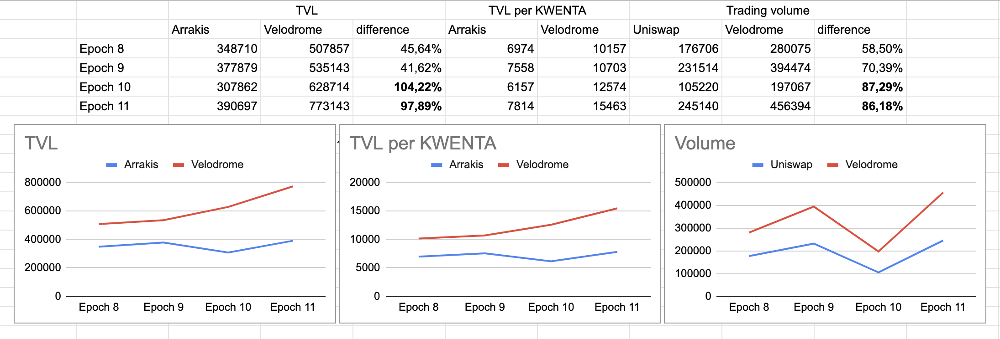

## Simple Summary
This KIP proposes to incentivize liquidity mining on Velodrome based on the findings from the second trial phase.

## Abstract
KIP-46, KIP-49, and KIP-50 (Section 5.6 of the KSL) introduced a trial of liquidity mining between Uniswap and Velodrome. The results of the second trial have been analyzed and, as a result, this KIP proposes to incentivize liquidity mining on Velodrome.

## Motivation
The second trial revealed that the Velodrome WETH/KWENTA pool was able to attract roughly 100% more TVL per 1 KWENTA of incentives compared to the Arrakis WETH/KWENTA pool. Additionally, the KWENTA trading volume during this period was 87% higher on Velodrome than on Uniswap. These findings have led to the conclusion that Velodrome is the more efficient platform for liquidity mining incentives.

## Specification
The allocation of liquidity mining incentives will be based on the KWENTA inflation schedule, starting from epoch 14. The incentives will be equal to 0.9% of the scheduled inflation for each epoch. For example, in epoch 14, the incentives will be 99.44 KWENTA, while in epoch 15, the incentives will be 97.40 KWENTA.

Liquidity minig incentives allocation schedule:
* Epoch 13 (100 $KWENTA): 50% Velodrome, 50% Arrakis 
* Epoch 14: 65% Velodrome, 35% Arrakis 
* Epoch 15: 80% Velodrome, 20% Arrakis 
* From epoch 16 and beyond, all of the liquidity mining incentives will be allocated solely to Velodrome. 

## Copyright
Copyright and related rights waived via [CC0](https://creativecommons.org/publicdomain/zero/1.0/).