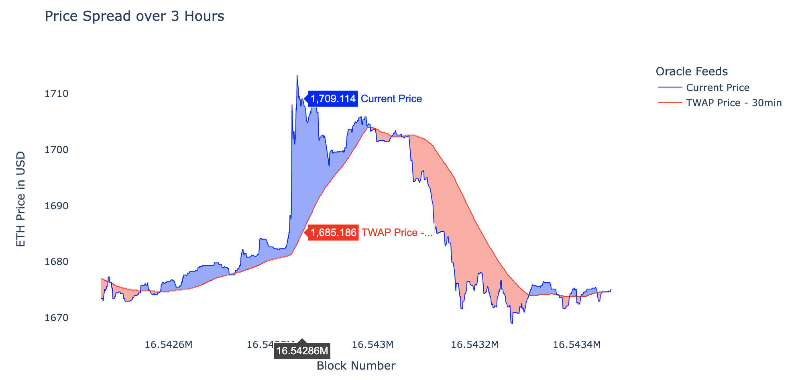

## Summary

Build a perpetuals market using Uniswap TWAP (Time Weighted Average Price) oracles. 

## Abstract

TWAP Perpetuals will enable Kwenta to scale its trading experience to other chains, at a lower cost, and in an atomic manner. 

## Motivation

Currently perpetual futures are offered on Optimism and are powered by Synthetix. Kwenta cannot capture markets on other chains unless an integration partner is available on other chains. Creating a perpetuals mechanism built on top of AMMs as widespread as Uniswap removes the bounds to where traders can trade with Kwenta. 

Secondly, fees are typically used to protect liqudity providers which can drive up costs for traders when a mechanism is inefficient at mitigating risk. By creating a mechanism that erases risk for LPs, Kwenta can offer a lower fee trading experience where fees are the cost of attracting passive liqudity providers seeking a low risk return.

Lastly, in the current state of Synthetix Perps V2, the mechanism is only viable for traders using the delayed order mechanism. This creates issues for protocols that want to combine perpetual futures into other products. Because trades cannot be executed atomically (at a reasonable cost) products like permissionless funding rate arbitrage vaults or onchain social trading strategies cannot be created.

In theory, the scalability of this mechanism is limitless and a perpetual market can be deployed for any long tail asset given sufficient liquidity. 

## Specification

The first phase of this task will be to build an MVP that tests the viability of this mechanism and will focus primarily on ETH -- as it is the deepest market available on most Ethereum based chains. 

The initial deploy will be on Arbitrum because Optimism currently creates a new block for each transaction. This drastically decreases the cost to manipulate a TWAP oracle. Building on Optimism is not feasible until Optimism Bedrock which introduces block times. 

### Spread Based Pricing

At all times there will be two price feeds for trading. The first is the 30 minute TWAP window price and the second is the current spot price. By executing orders at the "worst" price of the two, we create a **price spread**. 

> For example, if the current ETH price is $1730 and the TWAP price is $1700 a long position will be executed at $1730 and short position is executed at $1700. 

By providing pricing as a spread we can offer trading at a low fee cost. The reason we use the worst of the two price feeds is to protect against latency arbitrage when the two feeds diverge. The spread purely serves as a protection mechanism when markets are volatile. Any profit opportunity from exploiting the lagging oracle is effectively neutralized. This decreases the risk for liquidity providers and because of this there is no need to scale fees to protect the mechanism. Therefore, the remainder of any fees charged is whatever is enough to attract liquidity.

*Example of price spread over 3 hours. At selected block, longs would executed at $1,709 and shorts would executed at $1685. Meaning if you instantaneously opened and closed this position you would be at a loss. However, this is similar to any order book exchange with a bid-ask spread.*

All order book based exchanges have a bid-ask spread. This spread is typically a function of liquidity - the more liquidity there is, the smaller the spread (also hence the need for market makers). To offer derivatives onchain without pricing liquidity is futile. The TWAP spread mimics a bid-ask spread onchain and can also be a function of liquidity (see next section). In theory, we should be able to use liqudity to eventually lower the TWAP window, decrease the spread, and create a more efficient trading system.

It's also important to note that because the oracle is fully onchain, this mechanism can be used atomically and is composable with other protocols. 

### Counterparty Liquidity Provisioning

The initial model for liquidity will be a stable vault of either USDC, DAI, or a stablecoin native to the deployed chain. This simplifies the initial implementation and allows profits or losses to easily be settled in USD.

> Synthetix V3 will provide a way to bootstrap pools of liquidity for protocols building financial derivatives. It is possible to build TWAP Perps as an SNXv3 "Market" as the mechanism can function agnostic of the base liquidity pool. This avenue can be explored if V3 permissionless pools are ready before our MVP.

In the future we'd like to explore depositing this liquidity into Uniswap V3 positions. This would allow us to strengthen the TWAP oracle for illiquid pairs. See *Scalability and Future Research* for more details.

### Oracle & Manipulation Resistance

We anchor our mechanism to a TWAP price because this provides robust security against oracle manipulation. As of Sept 2022 on Ethereum mainnet, an attempt to move a 30 minute TWAP oracle by 20% on the WETH/USDC 5bp pair would cost ~709 billion USD. And the cost to fees would be greater than the GDP of the American Samoa.1

There are two main levers that can be used to defend against oracle manipulation. The length of the TWAP window and liquidity range/depth. 

Initially, the TWAP window will be set to 30 minutes, as this achieves the best tradeoff between security and trade execution. The longer the window, the more secure the oracle is. The shorter the window, the closer the oracle is to the current price. This can be tweaked based on future analysis.

> Additionally, it is Kwenta's responsibilty to make sure the observations are initialized properly on a Uniswap pair.2 If trades are executed every block and there is a block time of two seconds (Optimism Bedrock), we need an array that can hold 900 observations for an accurate 30 minute TWAP (1800 seconds / 2 block time).

Full range liquidity is a strong deterrent against oracle manipulations. Even just a small amount of full range liquidity is enough to drive up the costs to manipulate a TWAP oracle significantly.3 This example of IDLE/WETH from [Euler](https://docs.euler.finance/euler-protocol/getting-started/methodology/oracle-rating#how-to-improve-the-oracle-rating) shows $52k of wide range liquidity would incur a minimum cost of attack of $115m. It will be in Kwenta's best interest to incentivize full range liquidity for pairs with perpetual markets built on top. 

### Scalability and Future Research

#### Uniswap LP Vault

The end goal for liquidity provisioning will be a hybrid between the stablecoin vault and Uniswap full range LP vault -- if not fully the latter. The full range LP vault would enable liquidity providers to deposit, for example, WETH/USDC full range liquidity to the mechanism. As the platform grows, the side effect is that liquidity deepens on the Uniswap for a given asset pair making the oracle more tamper resistant.

With a more robust price oracle we can continue to lower the TWAP window essentially reducing the spread as the system scales and create more efficient markets. 

#### Harmonic Liquidity Based Slippage

#### N-1 Arbitrage Risk

## References

1. https://blog.uniswap.org/uniswap-v3-oracles
2. https://docs.uniswap.org/concepts/protocol/oracle
3. https://github.com/euler-xyz/uni-v3-twap-manipulation/blob/master/cost-of-attack.pdf

## Copyright

Copyright and related rights waived via [CC0](https://creativecommons.org/publicdomain/zero/1.0/).

