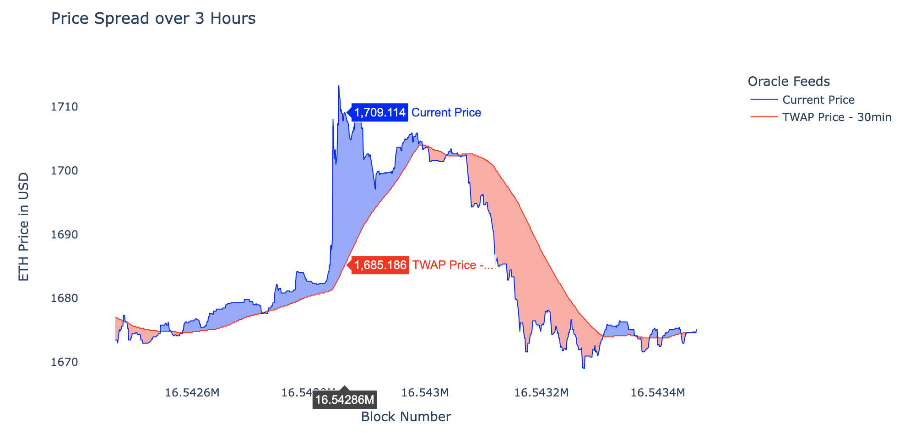

## Summary

Build a perpetuals market using Uniswap TWAP (Time Weighted Average Price) oracles.

## Abstract

TWAP Perpetuals will enable Kwenta to scale its trading experience to other chains, at a lower cost, and in an atomic manner.

## Motivation

Currently perpetual futures are offered on Optimism and are powered by Synthetix. Kwenta cannot capture markets on other chains unless an integration partner is available on other chains. Creating a perpetuals mechanism built on top of AMMs as widespread as Uniswap removes the bounds to where traders can trade with Kwenta.

Secondly, fees are typically used to protect liqudity providers which can drive up costs for traders when a mechanism is inefficient at mitigating risk. By creating a mechanism that erases risk for LPs, Kwenta can offer a lower fee trading experience where fees are the cost of attracting passive liqudity providers seeking a low risk return.

Lastly, in the current state of Synthetix Perps V2, the mechanism is only viable for traders using the delayed order mechanism. This creates issues for protocols that want to combine perpetual futures into other products. Because trades cannot be executed atomically (at a reasonable cost) products like permissionless funding rate arbitrage vaults or onchain social trading strategies cannot be created.

In theory, the scalability of this mechanism is limitless and a perpetual market can be deployed for any long tail asset given sufficient liquidity.

## Specification

The first phase of this task will be to build an MVP that tests the viability of this mechanism and will focus primarily on ETH -- as it is the deepest market available on most Ethereum based chains.

The initial deploy will be on Arbitrum testnet.

### Spread Based Pricing

Infinite liquidity for derivatives is a compelling concept, but with no cost to this liquidity a protocol opens itself to attack (toxic flow). Market makers on centralized exchanges create a bid-ask spread to protect themselves against toxic flow. To protect LPs (our market makers) TWAP perpetuals proposes an onchain price spread all while balancing a robust trading experience and fully composable derivative.

There will be two price feeds for trading. The first is the 30 minute TWAP window price and the second is the current spot price. By executing orders at the "worst" price of the two, we create a **price spread**. 

> For example, if the current ETH price is $1730 and the TWAP price is $1700 a long position will be executed at $1730 and short position is executed at $1700.

By providing pricing as a spread we can offer trading at a low fee cost. The reason we use the worst of the two price feeds is to protect against latency arbitrage when the two feeds diverge. The spread purely serves as a protection mechanism when markets are volatile. Any profit opportunity from exploiting the lagging oracle is effectively neutralized. This decreases the risk for liquidity providers and because of this there is no need to scale fees to protect the mechanism. Therefore, the remainder of any fees charged is whatever is enough to attract liquidity.

_Example of price spread over 3 hours. At selected block, longs would executed at $1,709 and shorts would executed at $1685. Meaning if you instantaneously opened and closed this position you would be at a loss. However, this is similar to any order book exchange with a bid-ask spread._

It's also important to note that because the oracle is fully onchain, this mechanism can be used atomically and is composable with other protocols.

### Liquidity Provisioning

The initial model for liquidity will be a stable vault of either USDC, DAI, or a stablecoin native to the deployed chain. This simplifies the initial implementation and allows profits or losses to easily be settled in USD.

> Synthetix V3 will provide a way to bootstrap pools of liquidity for protocols building financial derivatives. It is possible to build TWAP Perps as an SNXv3 "Market" as the mechanism can function agnostic of the base liquidity pool. This avenue can be explored if V3 permissionless pools are ready before our MVP.

A percentage (if not initially 100%) of this liquidity will be wrapped and deposited into Uniswap V3 as a full range liquidity position. This not only provides extra yield for LPs, but is essential to deepening the liquidity of a pair and strengthening its oracle. 

Once this liquidity growth and scaling model is proven for ETH/USD, it can be scaled scaled to other asset pairs that may be more illiquid.
 
#### Side Effects

A side effect of wrapping liquidity as full range Uniswap LP positions is that it deepens the liquidity of the underlying Uniswap pair. Therefore, building a perpetuals market for a given asset subsdizes liquidity for traditional swapping. 

This is interesting because given sufficient success and scale of this mechanism there could be B2B demand for Kwenta to spin up perpetual markets for other protocols and DAOs looking to improve token liquidity.

### Oracle & Manipulation Resistance

Initially, the TWAP window will be set to 30 minutes, as this achieves the best tradeoff between security and trade execution. The longer the window, the more secure the oracle is. The shorter the window, the closer the oracle is to the current price. This can be tweaked based on future analysis.

### Liquidity

Oracle robustness is partly a function of system liquidity. As more traders trade, more liquidity enters the system, and the mechanism becomes more resistant to manipulation. The more resistant it is to manipulation, the more we can decrease the spread and attract more traders.

We anchor our mechanism to a TWAP price because this provides robust security against oracle manipulation. As of Sept 2022 on Ethereum mainnet, an attempt to move a 30 minute TWAP oracle by 20% on the WETH/USDC 5bp pair would cost ~709 billion USD. And the cost to fees would be greater than the GDP of the American Samoa.1

Full range liquidity is a strong deterrent against oracle manipulations. Even just a small amount of full range liquidity is enough to drive up the costs to manipulate a TWAP oracle significantly.3 This example of IDLE/WETH from [Euler](https://docs.euler.finance/euler-protocol/getting-started/methodology/oracle-rating#how-to-improve-the-oracle-rating) shows $52k of wide range liquidity would incur a minimum cost of attack of $115m. 

> Additionally, it is Kwenta's responsibilty to make sure the observations are initialized properly on a Uniswap pair.2 For example with Optimism (Bedrock), if trades are executed every block and there is a block time of two seconds, we need an array that can hold 900 observations for an accurate 30 minute TWAP (1800 seconds / 2 block time).

It will be in Kwenta's best interest to incentivize full range liquidity for pairs with perpetual markets built on top.

#### Block Proposal Mechanism

Oracle robustness is also a function of the underlying network block proposing mechanism. The harder it is to control blocks over a TWAP window, the lower this TWAP window can be.

For example, Arbitrum uses a first-come, first-serve (FCFS) model for sequencing transactions. This FCFS model makes it hard for an exploiter to control block ordering -- especially over a long period of time, as many other users are submitting transactions to the network. At the current Arbitrum block time (~.25 seconds) the exploiter would have to sequence roughly 7200 blocks to have full control over a 30 minute TWAP. This sort of attack becomes more and more unlikely as the network grows.

Alternatively, the exploiter could take advantage sequencer downtime. For example, flooding the sequencer (DoS attack) for a 30 minute period. Although this attack is unlikely as Arbitrum matures and typically economically unfeasible, something that is more likely is unplanned downtime. A good example of downtime was a recent bug that halted the sequencer for an hour.4 In this case if a malicious actor was able to predict upcoming downtime they could manipulate the underlying Uniswap pool right before downtime and then backrun their own manipulation hours later after the blackout. However, this has the strong assumption that they have full awareness over the blackout window.

Ideally as Arbitrum (or rollups in general) begin to mature and progressively decentralize, there will be less downtime and consecutive blocks become harder to control. As a result, we can continue to lower the TWAP window and tighten the spread. 

## References

1. https://blog.uniswap.org/uniswap-v3-oracles
2. https://docs.uniswap.org/concepts/protocol/oracle
3. https://github.com/euler-xyz/uni-v3-twap-manipulation/blob/master/cost-of-attack.pdf
4. https://blockworks.co/news/arbitrum-network-bug-experimental-rollups
