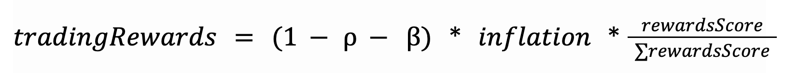

# 3. Tokenomics

## Table of Content

1. [Allocation breakdown](#allocation-breakdown)
2. [Inflation Allocation](#inflation-allocation)
3. [Vesting Mechanism](#vesting-mechanism)
4. [Staking Mechanism](#staking-mechanism)

---

The Kwenta token launched on November 15, 2022. The token follows the below model:

- Ticker - KWENTA
- Initial Supply - 313,373
- Inflation Model - Weekly emissions will start at 14,463.37 $KWENTA the first week and drop to around 200 $KWENTA (1% APY) at the end of four years. Resulting in a total supply at the end of four years of 1,009,409.43 (note that this number was updated after CCs evaluated feasibility).

## Allocation breakdown

- 30% - Synthetix Stakers
- 5% - synthetix.exchange and early Kwenta Traders
- 5% - Investment
- 25% - Community Growth Fund
- 15% - Core Contributors
- 20% - Kwenta Treasury

## Inflation Allocation

20% of inflation is routed to the treasury, 20% of inflation is dedicated towards trading rewards (15% is earmarked for future trading incentives by the treasury) and 60% of inflation is routed to stakers.

This will enable Kwenta to sustainably fund DAO roles while enabling the community to use the entire token supply as needed.

Inflation is minted once per week by a keeper, however, this mint functionality can be called by anyone in the event the Kwenta DAO keeper is unable to mint rewards. The reward for minting is 1 KWENTA per mint.

## Vesting Mechanism

KWENTA printed via inflation will undergo a 1-year lock-up period. The lock-up mechanism will begin with a 90% fee for vesting KWENTA early which will decay linearly. If tokens are vested early, the percentage of tokens that are still applicable to the fee will be taken out of circulation and returned to the Kwenta Treasury. After one year, the fee would reach 0% and no tokens would be forfeited when vesting KWENTA.

## Staking Mechanism

The Kwenta staking system will have two primary functions:

1. Governance: staked KWENTA will gain voting power within the system enabling stakers to vote in elections and CKIPs offering the protocol a decentralized decision making mechanism.

2. Protocol Rewards: Staked KWENTA will earn inflationary rewards. This mechanism will empower members dedicated to the protocol to increase their influence over decision making. Stakers who are active traders are eligible for additional KWENTA rewards. All trading rewards are limited to Perps V2 usage.

The inflationary rewards will be split into two types of rewards: pure inflationary rewards and trading rewards (determined by a trading score). 60% of inflation is allocated to the pure inflationary (𝜌) rewards. This enables the treasury and growth fund, when staked, to retain a proportion of the supply, better preparing the protocol to operate sustainably and provide additional incentives for trading, DAO roles, marketing, etc.

20% (15% of this is currently earmarked in the treasury for future use) of inflation will be distributed to KWENTA stakers according to a rewards score that is a function of staking participation and trading activity. The rewards score will be a Cobb-Douglas function with exponential weighting (that ideally will favor trading activity):

For epochs 21 and 22 only, `rewards_score` will be calculated using the formula `rewards_score = fees_paid^a * (staked_KWENTA+0.1)^1-a` in order to trial a non-stake $KWENTA rewards program.

It’s important to note that 𝑓𝑒𝑒𝑠*𝑝𝑎𝑖𝑑 is used here rather than 𝑡𝑟𝑎𝑑𝑖𝑛𝑔𝑣𝑜𝑙𝑢𝑚𝑒 to prevent abuse. Since different markets will have lower fees than others (e.g. FOREX markets may have extremely low fees), malicious stakers may inflate their rewards by trading large volumes in low fee markets. Keeper fees are excluded from 𝑓𝑒𝑒𝑠*𝑝𝑎𝑖𝑑 to avoid abuse from self-executed transactions. Limiting 𝑓𝑒𝑒𝑠_𝑝𝑎𝑖𝑑 to only include protocol fees levels the playing field for all stakers and ensures that traders must take risk to earn rewards.

To focus rewards on volume generated from Kwenta's frontend, 𝑓𝑒𝑒𝑠_𝑝𝑎𝑖𝑑 will be limited to trades with a tracking code of KWENTA starting at epoch 14.

An individual staker’s trading rewards are then evaluated as:

Configurable Values

- 𝜌 – share of inflation allocated to pure staking rewards (default = 0.6)
- β – diversion to treasury (default = 0.2)
- 𝑎 – weight applied to 𝑓𝑒𝑒𝑠*𝑝𝑎𝑖𝑑 in 𝑟𝑒𝑤𝑎𝑟𝑑𝑠*𝑠𝑐𝑜𝑟𝑒 calculation (default = 0.7)

Inflationary KWENTA rewards are locked for a period of 1 year but will have transferability so that the protocol can redirect inflationary rewards earned from the growth fund and treasury as needed. Once the one year vesting period is complete, KWENTA can be withdrawn from the staking portal and freely used at the stakers’ discretion. KWENTA rewards that are vesting can be staked to increase voting power and weekly rewards.

Staking is only available on Optimism (Layer 2) Kwenta.
